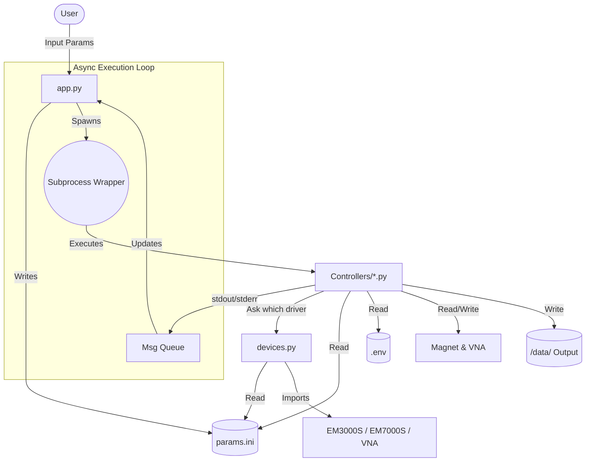

Here is a comprehensive `README.md` designed for developers maintaining or extending this codebase. It focuses on architecture, data flow, and controller logic.

---

# Instrument Control Sweep Interface

## Overview

This project is a modular instrument control application designed to automate magnetic field sweeps while simultaneously capturing S-parameter data from a Vector Network Analyzer (VNA). It features a **decoupled architecture** where the User Interface (GUI) runs separately from the hardware control logic, communicating via subprocesses and configuration files.

## 1. System Architecture

The application uses a **Producer-Consumer** pattern mediated by Python's `asyncio` and `subprocess` modules.

* **The Frontend (`app.py`)**: A Tkinter-based GUI that manages configuration and process scheduling. It does *not* block on hardware I/O.
* **The Backend (Controllers)**: Standalone Python scripts that perform the actual blocking hardware operations.
* **State Management**: Shared state is maintained via `params.ini` (experiment parameters *and* the selected instruments) and `.env` (hardware addresses).
* **Instrument Selection**: `devices.py` turns the `[Devices]` entries in `params.ini` into driver classes, so no logic script names a magnet.



---

## 2. The Controller Ecosystem (`/controllers`)

The core logic resides in `controllers/`. These scripts are designed to be run as subprocesses but can also be executed manually for debugging.

### Hardware Drivers

* **`EM3000S.py` (Magnet Driver)**:
* **Protocol**: Custom reverse-engineered Hex byte protocol over Serial (19200 Baud, 8-N-1).
* **Key Logic**: Maps current (Amps) to Hex values using a cubic polynomial fit ().
* **Safety**: Implements `stop_and_query_field()` to safely ramp down the magnet before disconnecting.


* **`EM7000S.py` (Magnet Driver, not yet operational)**:
* Same public API as `EM3000S.py`, so every logic script drives it unchanged.
* **Control signals**: opcodes, link settings, current limit, current-mapping
coefficients and calibration filename are all hoisted into one block at the top of
the file. The values there are EM3000S placeholders, **not** EM7000S measurements.
* **Guard**: `connect()` raises until `SIGNALS_VERIFIED = True`. Capture the vendor
application driving an EM7000S, correct the block, re-calibrate, then flip the flag.


* **`VNA.py` (VNA Driver)**:
* **Protocol**: Standard SCPI commands via VISA (TCPIP).
* **Key Logic**: Wraps `pyvisa` to handle query timeouts and data parsing (interleaved Real/Imaginary data -> Complex Numpy array).


### Device Registry (`devices.py`)

The single place that knows which drivers exist. `MAGNETS` and `VNAS` map the display
name shown in the app's **Configuration** tab to `(module, class)`; the selection is read
from `params.ini` `[Devices]` and the driver is imported lazily, so an unselected or
half-finished driver can never break a run.

```python
from devices import get_magnet_controller
MagnetController = get_magnet_controller()   # class for the selected magnet
```

Adding a magnet: drop a driver exposing a `MagnetController` with the EM3000S API into
this directory, add one line to `MAGNETS`. The GUI dropdown picks it up automatically.

Per-magnet differences that logic scripts rely on are class attributes: `max_current`
(the |I| limit, and the span `calibration.py` sweeps) and `calibration_file` (that
magnet's own mT ↔ A curve, read back by `set_field()`).

### Logic Scripts

* **`detect.py`**:
* Scans all VISA resources (`@py` backend).
* Heuristically identifies instruments (ASRL = Magnet, TCPIP = VNA).
* **Output**: Writes confirmed Resource IDs to `.env`.


* **`experiment.py`**:
* The main run loop.
* Reads `params.ini` for start/stop/step values.
* Iterates through current steps  Sets Magnet  Waits 2s  Averages 3 VNA sweeps  Saves CSV.


* **`calibration.py`**:
* Sweeps current across the selected magnet's full range (`±magnet.max_current`).
* Records internal Gaussmeter readings to map **Amps  mT**.
* **Output**: `magnet.calibration_file` — `field_calibration_data.csv` for the EM3000S,
`field_calibration_data_em7000s.csv` for the EM7000S.


* **`abort_all.py`**:
* Emergency script. Attempts to connect to the magnet independent of the main process to issue a Stop command (`0x2B`).


---

## 3. Data I/O & File Structure

### Configuration (`params.ini`)

The GUI and controllers share state via this INI file.

```ini
[Experiment]
low = 0         ; Start Current/Field
high = 1        ; End Current/Field
step = 0.1      ; Step Size
unit = A        ; 'A' or 'mT'

[Calibration]
cal_res = 800   ; Resolution points for calibration sweep

[Magnet]
value = 326     ; One-shot set from the Magnet tab
unit = mT       ; 'A' or 'mT'

[Devices]
magnet = EM3000S  ; Key in devices.MAGNETS - written by the Configuration tab
vna = ZNLE        ; Key in devices.VNAS

```

### Output Data Schema

Data is organized hierarchically to prevent overwrites.

* **Root**: `/data`
* **Sweep Directory**: Named by parameters to ensure uniqueness.
* *Format*: `s_params_{START}{UNIT}_to_{END}{UNIT}_step_{STEP}{UNIT}`


* **Run Directory**: Incremented integer (e.g., `/1`, `/2`) to allow multiple runs of the same parameters.
* **Files**: One CSV per step.
* *Format*: `{Current/Field_Value}.csv`
* *Content*: Frequency, S11/S12/S21/S22 (Real, Imag, dB, Phase).


---

## 4. The GUI Engine (`app.py`)

The `app.py` script is the orchestrator. It uses a **Threaded Asyncio** model to keep the UI responsive.

### Key Components:

1. **`msg_queue`**: A thread-safe `queue.Queue()`.
* The background thread pushes `("print", "message")` or `("status", "message")` tuples.
* The Main Thread polls this queue every 100ms via `root.after()`.


2. **`run_script_async(script_name)`**:
* Creates a `subprocess.exec`.
* Pipes `stdout` and `stderr` continuously to the `msg_queue`.
* This allows the GUI to show real-time print statements from the controllers (e.g., "Setting field to 0.5T...").


3. **Abort Logic**:
* Sends `SIGTERM` to the active subprocess.
* Immediately schedules `abort_all.py` to ensure the hardware is not left in a high-energy state.


4. **Configuration Tab**:
* Two read-only comboboxes populated from `devices.MAGNETS` / `devices.VNAS`.
* Selecting writes `[Devices]` to `params.ini` immediately (`on_device_change`), because the controllers only read it at process start.
* `app.py` imports `devices` directly by putting `controllers/` on `sys.path`; the module is stdlib-only and imports drivers lazily, so the GUI never pulls in `pyvisa`.


## 5. Setup & Installation

### Requirements

* **Python 3.9+**
* **Drivers**: `pyvisa`, `pyvisa-py`, `pyserial`
* **Data/Math**: `numpy`, `pandas`, `matplotlib`
* **GUI**: `tkinter` (usually standard with Python)

### Developer Quick Start

1. **Hardware Emulation**:
* If no hardware is present, enable `lab_emulator.py` inside `experiment.py` by uncommenting the import. It sits *after* the registry lookup, so it shadows whatever the Configuration tab selected:
```python
MagnetController = get_magnet_controller()
VNAController = get_vna_controller()
# Uncomment to run without hardware (overrides the selection above):
from lab_emulator import MagnetController, VNAController   <-- Uncomment this

```


2. **Running the App**:
```bash
python app.py

```


3. **Debugging**:
* Check `.env` to see if instruments were detected correctly.
* Check which drivers are selected: `python controllers/devices.py`.
* Run controllers individually to isolate errors (from the repo root — `params.ini` and the calibration CSVs resolve relative to the CWD):
```bash
python controllers/detect.py
python controllers/experiment.py

```